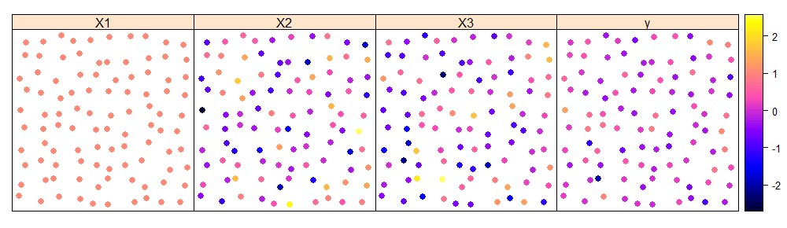

## Spatially Varying Coefficients Models

### Introduction

One of the most known regression methods is the Ordinary Least Squares (OLS). It is easy to model and interpret. However, when dealing with *spatial data*, the model assumptions usually do not hold anymore. More specifically, observations that are close in distance are more dependent than observations which are far apart. That is were geo-statistical methods come into play. 

With these methods, we try to explain the *residual dependencies* with, say, a Gaussian Process. These proceeses capture the dependency on the observations via distance in its covariance function. Finally, using geo-statistical methods we model covariates as a fixed external trend while we let the intercept vary over space.

### Motivation

The Spatially Varying Coefficients (SVC) Models generalizes the idea of geo-statistical methods. Instead of fixed external trends, we allow to model some or all covariates in the same way as we would the intercept in geo-statistical methods. That is, we allow the *covariates effects vary over space*. 

**Example**: Say we have 100 locations where we sample data of one response y and two covariates. In order to fit an intercept, we add one covariate (X1) which is equal to one at each sample location. The other two covariates we name X2 and X3. The avaiable data thus may look like this:

So, say, the data are apartment transactions where y is the transaction price, X2 is the floor area and X3 is the year when the aparment has been built. What we do not know and what we try to estiamte are the SVC, i.e. the generating process. 

The underlying equation is based on the one from OLS, but the effect sizes vary over space, i.e. they are not constant. Thus, given a location $\huge{s}$, the model formula in our example is

$$\huge{y(s) = \beta_1(s) + \beta_2(s) x^{(2)} + \beta_3(s) x^{(3)} + \varepsilon(s)} $$

where the betas correspond to effect 1 to effect 3 and epsilon, i.e. the nugget,  corresponds to effect 4. So, in the end we want to estimate the effect sizes at given locations.

### Work on Package

There are several methods how to model and predict SVC models. We are currently working on an R package that allows to fit large data sets with several covariates. Stay tuned for updates!